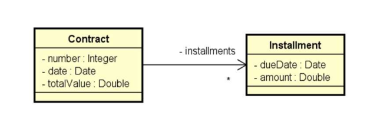
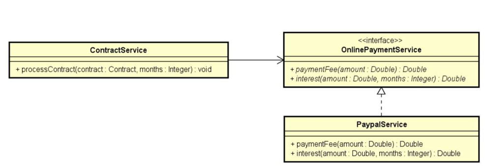

# Parcelas para um contrato

## Descrição:

Este repositório foi criado para a resolução do exercício de fixação da seção “18: Interfaces”, do curso Java COMPLETO 2023 Programação Orientada a Objetos +Projetos, do professor Nélio Alves.

## Objetivo:

O exercício tem como objetivo, treinar o uso de interfaces para realizar a **inversão de controle** por meio da **injeção de dependência** por construtor. Neste exercício, o objetivo é basicamente criar uma classe Contrato que vai ter várias parcelas, estas parcelas são instâncias da classe Parcela. O desafio é evitar o forte acoplamento por meio do padrão de desenvolvimento de **inversão de controle.**

## Enunciado do Exercício:

Uma empresa deseja automatizar o processamento de seus contratos. O processamento de um contrato consiste em gerar as parcelas a serem pagas para aquele contrato, com base no número de meses desejado.

A empresa utiliza um serviço de pagamento online para realizar o pagamento das parcelas. Os serviços de pagamento online tipicamente cobram um juro mensal, bem como uma taxa por pagamento. Por enquanto, o serviço contratado pela empresa é o do Paypal, que aplica juros simples de 1% a cada parcela, mais uma taxa de pagamento de 2%.

Fazer um programa para ler os dados de um contrato (número do contrato, data do contrato, e valor total do contrato). Em seguida, o programa deve ler o número de meses para parcelamento do contrato, e daí gerar os registros de parcelas a serem pagas (data e valor),sendo a primeira parcela a ser paga um mês após a data do contrato, a segunda parcela dois meses após o contrato e assim por diante. Mostrar os dados das parcelas na tela.

## Diagrama de classe das entidades (entities)

## Diagrama de classe dos serviços (services)

## Tecnologias utilizadas:

- Java

## Conhecimentos focados no exercício:

- Interfaces no Java
- Inversão de controle / Injeção de dependência

## Autor

Pedro Henrique Laurindo da Silva

[https://www.linkedin.com/in/pedro-henrique-laurindo-23347a232](https://www.linkedin.com/in/pedro-henrique-laurindo-23347a232)
